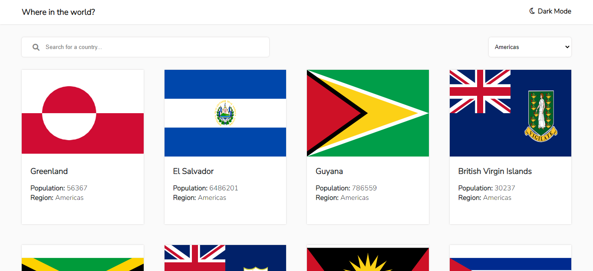

# REST Countries API with color theme switcher solution

This is a solution to the [REST Countries API with color theme switcher challenge on Frontend Mentor](https://www.frontendmentor.io/challenges/rest-countries-api-with-color-theme-switcher-5cacc469fec04111f7b848ca).

## Table of contents

- [Overview](#overview)
  - [The challenge](#the-challenge)
  - [Screenshot](#screenshot)
  - [Links](#links)
- [My process](#my-process)
  - [Built with](#built-with)
- [Author](#author)

## Overview

### The challenge

Users should be able to:

- See all countries from the API on the homepage
- Search for a country using an `input` field
- Filter countries by region
- Click on a country to see more detailed information on a separate page
- Click through to the border countries on the detail page
- Toggle the color scheme between light and dark mode *(optional)*

### Screenshot

### Links

- Solution URL: [Click here](https://www.frontendmentor.io/solutions/anywhere-in-the-world-app-using-vuejs-ldVd6nnV4h)
- Live Site URL: [Click here](https://anywhereintheworld.netlify.app/)

## My process

### Built with

- Flexbox
- CSS Grid
- Mobile-first workflow
- [Vuejs](https://vuejs.org/) - JS library
- [Vuex](https://vuex.vuejs.org/) - For state management

## Author

- Website - [Ernest Isaac](https://www.ernestizic.tech)
- Frontend Mentor - [@ernestizic](https://www.frontendmentor.io/profile/ernestizic)
- Twitter - [@ernestizic](https://www.twitter.com/ernestizic)
